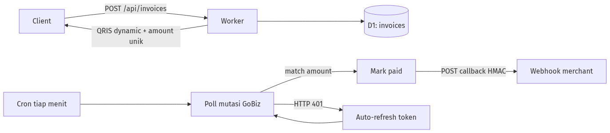

# qris-pg

[](https://jenilutfifauzi.github.io/qris-pg/)
[](LICENSE)
[](https://jenilutfifauzi.github.io/qris-pg/#/)

QRIS payment kit di **Cloudflare Workers**: static→dynamic, kode unik, poll mutasi GoBiz, callback HMAC-signed, WebUI, auto-refresh token.

> ⚠️ **Unofficial** · personal use · tidak berafiliasi dengan Gojek/GoPay/GoBiz/BI. [DISCLAIMER](DISCLAIMER.md)

---

## Fitur

- **QRIS static → dynamic** — EMVCo TLV + CRC16, tanpa dependency runtime
- **Kode unik (unique amount)** — anti tabrakan antar invoice pending
- **Polling mutasi GoBiz** — cron tiap menit, matching otomatis by amount
- **Callback webhook** — HMAC-SHA256 (`X-Qris-Signature`), retry otomatis
- **Auto-refresh token** — token GoBiz diperbarui otomatis saat expired
- **WebUI dashboard** — Setup / Create / Invoices, dilindungi Basic Auth
- **API key auth** — semua endpoint (kecuali `/api/health`) butuh `X-API-Key`

## Cara kerja

```
Create → unique amount + QR dynamic → D1 pending
Cron 1×/menit → poll mutasi → match amount → paid + callback
```



Bukan webhook Gojek — kit ini yang melakukan polling.

---

## Quickstart

Butuh: Node 22+ (test pakai `node:sqlite`), akun Cloudflare, merchant GoBiz.

```bash
git clone https://github.com/jenilutfifauzi/qris-pg.git
cd qris-pg && npm i && npx wrangler login

npx wrangler d1 create qris-pg
# salin database_id → wrangler.jsonc

npm run db:remote
openssl rand -hex 24 | npx wrangler secret put API_KEY   # simpan key-nya
npx wrangler secret put DASH_USER
npx wrangler secret put DASH_PASS
npx wrangler deploy
```

Buka `https://qris-pg.<subdomain>.workers.dev` → **Setup**:

1. Paste **API Key**
2. Merchant ID + GoBiz Bearer + QRIS static (`000201…`)
3. **Save** → **Test mutasi**

> 📖 Instruksi lengkap: **[Deploy](https://jenilutfifauzi.github.io/qris-pg/#/deploy)** · **[Troubleshooting](https://jenilutfifauzi.github.io/qris-pg/#/troubleshooting)**

### Ambil Bearer GoBiz

Portal → **Transaksi** → F12 Network → request `transactions` **200** → copy `Authorization: Bearer <token>`.

---

## Secrets

| Apa | Di mana |
|-----|---------|
| `API_KEY` | `wrangler secret` / `.dev.vars` (gitignored) — auth API (fallback secret HMAC callback) |
| `CALLBACK_SECRET` | opsional — secret HMAC callback terpisah (fallback: `API_KEY`) |
| `DASH_USER` / `DASH_PASS` | `wrangler secret` — Basic Auth WebUI |
| GoBiz token, merchant, QRIS | D1 via WebUI (runtime) |

Source yang di-push **tanpa** token/password.

---

## API

Header: `X-API-Key: <API_KEY>` (kecuali `/api/health`). Rate limit create: 10/menit/IP.

### Buat invoice (create QRIS)

```bash
curl -s https://YOUR.workers.dev/api/invoices \
  -H "X-API-Key: $API_KEY" -H "content-type: application/json" \
  -d '{"amount":5000,"merchant_ref":"ORDER-1","expire_min":30,"callback_url":"https://your.app/hook"}'
```

| Parameter | Wajib | Deskripsi |
|-----------|-------|-----------|
| `amount` | ✅ | Nominal IDR. Ditambah **unique code** otomatis (mis. 5000 → 5500) biar anti tabrakan antar invoice pending |
| `merchant_ref` | — | Referensi order (max 128 char). `POST` ulang dengan ref yang masih `pending` → return invoice yang sama (idempotent) |
| `expire_min` | — | Masa berlaku, 1–1440 menit (default 30) |
| `callback_url` | — | Webhook saat lunas. Fallback ke `default_callback` dari Setup. Wajib URL publik http(s) — loopback/private ditolak |

Response `201`:

```json
{
  "id": "9f8c1a2b3d4e5f60",
  "merchant_ref": "ORDER-1",
  "amount": 5500,
  "base_amount": 5000,
  "unique_code": 500,
  "status": "pending",
  "qris_payload": "00020101021226620014ID.CO.QRIS.WWW...",
  "callback_url": "https://your.app/hook",
  "expires_at": "2026-08-03T12:00:00.000Z",
  "paid_at": null,
  "tx_id": null,
  "callback_sent": 0,
  "callback_attempts": 0,
  "created_at": "2026-08-03T11:30:00.000Z"
}
```

Tampilkan QR ke customer dari `qris_payload` (string EMVCo, render pakai library qrcode client-side — payload QRIS tidak dikirim ke pihak ketiga). Cek status kapan saja:

```bash
curl -s https://YOUR.workers.dev/api/invoices/9f8c1a2b3d4e5f60 -H "X-API-Key: $API_KEY"
# status: pending → paid (atau expired)
```

### Callback webhook

Saat invoice lunas, kit mengirim `POST` ke `callback_url`:

```json
{
  "id": "9f8c1a2b3d4e5f60",
  "merchant_ref": "ORDER-1",
  "amount": 5500,
  "status": "paid",
  "tx_id": "MUT-123456789",
  "paid_at": "2026-08-03T11:45:12.000Z",
  "unique_code": 500
}
```

Header: `Content-Type: application/json` · `Idempotency-Key: <tx_id>` · `X-Qris-Signature: sha256=<hex>` (HMAC-SHA256 dari **raw body**, secret = `CALLBACK_SECRET`, fallback `API_KEY`).

Verify signature di sisi penerima (WAJIB — siapa pun yang tahu `API_KEY` bisa forge callback):

```js
import { createHmac, timingSafeEqual } from "node:crypto";

// rawBody = body mentah sebagai string, JANGAN JSON.parse dulu
const sig = createHmac("sha256", process.env.QRIS_API_KEY)
  .update(rawBody).digest("hex");
const ok = timingSafeEqual(
  Buffer.from(`sha256=${sig}`),
  Buffer.from(req.headers["x-qris-signature"])
);
if (!ok) return 401;
```

Rules:
- **At-least-once** — kalau worker crash, callback bisa terkirim **lebih dari sekali**. Wajib dedup pakai `tx_id` / `Idempotency-Key` (simpan tx_id yang sudah diproses, ignore duplikat). Jangan pernah proses dua kali (risiko double-fulfillment).
- **Retry otomatis** — callback gagal di-retry tiap cron, maksimal 5×. Kirim ulang manual: `POST /api/invoices/:id/resend` → `{"ok":true}` (502 `CALLBACK_FAILED` kalau endpoint penerima error).
- Balas `2xx` = sukses; selain itu dianggap gagal dan di-retry.

> 📖 Referensi lengkap: **[API & Callback](https://jenilutfifauzi.github.io/qris-pg/#/api)** · **[DB Schema](https://jenilutfifauzi.github.io/qris-pg/#/api?id=skema-database)**

---

## Local

```bash
cp .dev.vars.example .dev.vars   # isi API_KEY
npm run db:local && npm run dev  # localhost:8787
npm test
```
