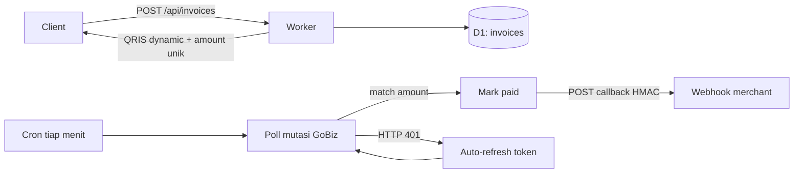

# qris-pg

Kit **QRIS payment gateway** untuk **Cloudflare Workers** (D1 + cron + WebUI): mengubah QRIS static menjadi dynamic, menambahkan kode unik, memantau mutasi GoBiz, lalu mengirim callback HMAC-signed saat invoice lunas.

> [!WARNING]
> Proyek **unofficial** untuk penggunaan pribadi/edukasi. Tidak berafiliasi dengan Gojek, GoPay, GoBiz, atau Bank Indonesia. API portal merchant bersifat reverse-engineered dan dapat berubah/putus tanpa pemberitahuan.

## Fitur

- **QRIS static → dynamic** — implementasi EMVCo TLV + CRC16, tanpa dependency
- **Kode unik (unique amount)** — bebas tabrakan antar invoice pending
- **Polling mutasi GoBiz** — cron tiap menit, matching otomatis by amount
- **Callback webhook** — HMAC-SHA256 (`X-Qris-Signature`), retry otomatis
- **Auto-refresh token** — akses token GoBiz diperbarui otomatis saat expired
- **WebUI dashboard** — Setup / Create / Invoices, dilindungi Basic Auth
- **API key auth** — semua endpoint (kecuali `/api/health`) butuh `X-API-Key`

## Arsitektur



Alur singkat:

```
Create invoice → amount unik + QR dynamic → tersimpan pending di D1
Cron 1×/menit → poll mutasi GoBiz → match amount → status paid → callback
```

## Stack

| Layer | Teknologi |
|---|---|
| Runtime | Cloudflare Worker (`src/index.js`) |
| Database | D1 (`src/db.js`) — tabel `settings`, `invoices`, `claimed`, `rate_limits` |
| Storage statis | Assets binding (`public/`) |
| Scheduler | Cron `* * * * *` |
| Dependency runtime | **0** (hanya devDependency `wrangler`) |

## Quickstart

Butuh: Node 18+, akun Cloudflare, akun merchant GoBiz.

```bash
git clone https://github.com/jenilutfifauzi/qris-pg.git
cd qris-pg && npm i && npx wrangler login

npx wrangler d1 create qris-pg      # salin database_id → wrangler.jsonc
npm run db:remote

openssl rand -hex 24 | npx wrangler secret put API_KEY
npx wrangler secret put DASH_USER
npx wrangler secret put DASH_PASS
npx wrangler deploy
```

Buka `https://qris-pg.<subdomain>.workers.dev` → **Setup**:

1. Paste **API Key**
2. Isi Merchant ID + GoBiz Bearer + QRIS static (`000201…`)
3. **Save** → **Test mutasi**

> Instruksi lengkap: [Deploy](/deploy) · [API & Callback](/api) · [Troubleshooting](/troubleshooting)

## Ambil Bearer GoBiz

Portal GoBiz → menu **Transaksi** → F12 Network → cari request `transactions` yang **200** → copy nilai `Authorization: Bearer …`

Token expired dalam hitungan jam → paste ulang, atau biarkan **auto-refresh** bekerja (lihat [Auto-refresh](/troubleshooting#auto-refresh-token)).

## Development lokal

```bash
cp .dev.vars.example .dev.vars   # isi API_KEY
npm run db:local && npm run dev  # localhost:8787
npm test                          # 8 test passing
```

## Changelog

Lihat [CHANGELOG](/changelog) untuk riwayat versi.

---

**Disclaimer:** bukan webhook resmi Gojek — kit ini yang melakukan polling. Untuk pemrosesan pembayaran produksi yang diatur regulasi, gunakan acquirer resmi.
